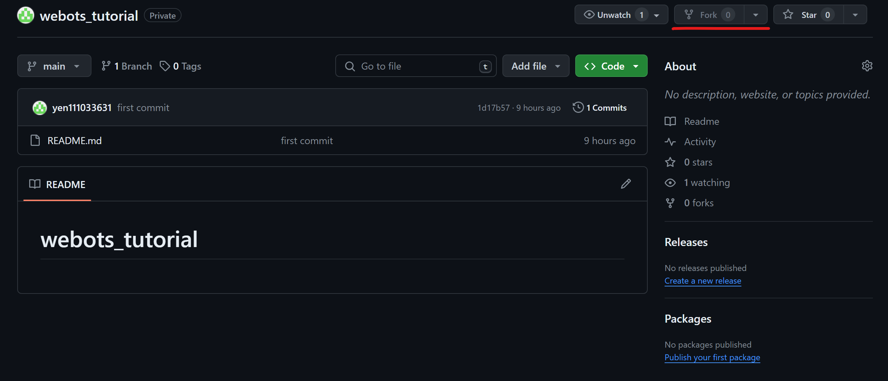
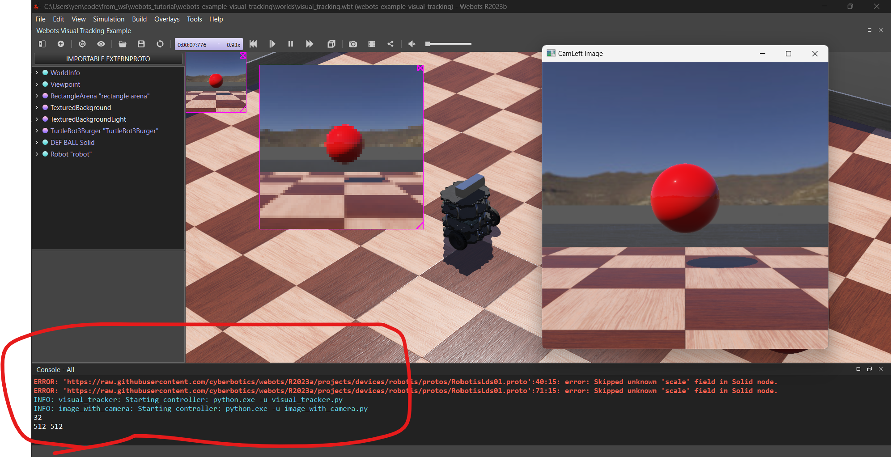
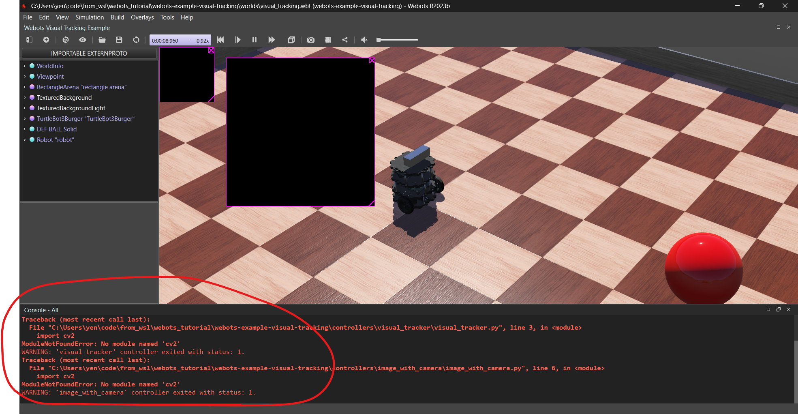

# webots_tutorial

0. system requirements
    ```
    OS: windows 10/11 or ubuntu 20.04/22.04 (recommended)
    programming language: python 3.8.18 (recommended)
    GPU: supposed to have
    ```


1. fork this repo (recommended)


2. git clone this repo

3. create a python virtual environment

4. in the environment, install python library in need with the terminal path in "webots_tutorial" folder  
`pip install -r requirements.txt`

5. install pytorch https://pytorch.org/

6. download webots app
    * for windows https://cyberbotics.com/
    * for ubuntu https://cyberbotics.com/doc/guide/installation-procedure#installing-the-debian-package-with-the-advanced-packaging-tool-apt (recommended)

7. luanch webots with the terminal path in "webots_tutorial" folder and in the python virtual environment  
windows: `webots .\webots-example-visual-tracking\worlds\visual_tracking.wbt`  
ubuntu: `webots webots-example-visual-tracking/worlds/visual_tracking.wbt  `
* if the console is like this, then you're ready! 



* if the console is like this, you have to figure out what's going on.


